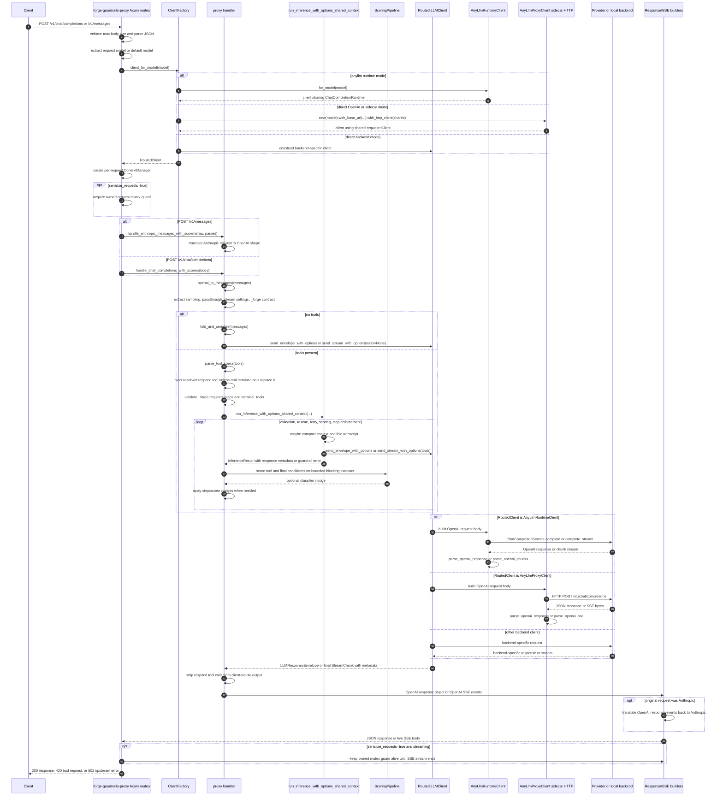

# Proxy Flow

This document describes the current request flow through the Forge proxy server.
It is a snapshot of how the code works now, not a target design.

This repo is Rust/Tokio. It does not use Python `asyncio`. The matching concerns
are Tokio async boundaries, scoped locks, shared clients, bounded stream parsing,
and avoiding repeated construction of expensive state.

## Current Request Flow

## Path Notes

- The standalone binary entrypoint is `src/bin/forge-guardrails-proxy/main.rs`.
  It builds a current-thread Tokio runtime, then serves Axum routes from
  `src/bin/forge-guardrails-proxy/routes.rs`.
- Each request gets a `RoutedClient` from `ClientFactory::client_for_model`.
  Runtime mode reuses the same anyllm runtime service through
  `AnyLlmRuntimeClient::for_model`. Direct OpenAI and sidecar paths rebuild a
  light client wrapper per request, but reuse the shared `reqwest::Client`.
- Non-streaming calls carry accepted response metadata through
  `LLMResponseEnvelope`. Streaming calls carry usage, usage details, and call
  info on the final `StreamChunk`. The `last_usage()`,
  `last_usage_details()`, and `last_call_info()` side channels remain
  compatibility shims, not the primary proxy data path for accepted responses.
- The proxy handler is shared library code in `src/proxy/handler.rs`. It owns
  OpenAI-to-internal message conversion, `_forge` contract handling, `respond`
  injection, validation retries, shared `ScoringPipeline` classifier nudges,
  step enforcement, and final response shaping.
- Proxy classifier JSONL logging uses a bounded async sink when
  `FORGE_CLASSIFIER_LOG` is set. Events can be dropped when the queue is full
  or an event exceeds `FORGE_CLASSIFIER_LOG_MAX_EVENT_BYTES`; set
  `FORGE_CLASSIFIER_LOG_REDACT=true` to redact payload fields before enqueue.
- Response and SSE formatting live in the library-private
  `src/proxy/response.rs`. The standalone binary's response module is a thin
  private wrapper over that same source, so CORS and SSE byte formatting stay
  aligned without making response builders public API.
- No-tools requests bypass guardrails through `run_passthrough`. Streaming
  passthrough is live from the backend, and usage/call metadata is read from
  the final backend stream chunk when available.
- Tool-using guarded requests may accept `stream=true`, but the client-visible
  stream is emitted after guardrail validation resolves a complete response.
  This preserves validation correctness at the cost of token-by-token guarded
  streaming. Guarded classifier work goes through bounded `ScoringExecutor`
  APIs so synchronous model scoring does not run on Tokio worker threads.
- Anthropic requests are translated to OpenAI request shape first, handled by
  the same guarded OpenAI path, then translated back to Anthropic response or
  Anthropic SSE events.
- Request body parsing and handler-to-HTTP status mapping are shared by the
  library server and standalone binary through a private helper. Route-specific
  orchestration, including binary model routing and per-request context
  construction, remains in each caller.

## Reuse And Drift Audit

| Area | Current state | Risk | Reuse direction |
| --- | --- | --- | --- |
| `src/proxy/response.rs` and `src/bin/forge-guardrails-proxy/response.rs` | Shared private response/SSE implementation; the binary module reuses the library source and exports only crate-local helpers. | Low drift risk. The tradeoff is a relative source include from the binary wrapper. | Keep this private unless there is an explicit public API decision. Continue testing both library server and standalone binary routes after SSE/header changes. |
| `parse_openai_sse` and `parse_openai_chunks` in `src/clients/anyllm_proxy/streaming.rs` | Sidecar SSE bytes and runtime chunk streams use the same bounded tool-call index checks and final response construction. Both attach usage, usage details, and call info to the final `StreamChunk`. | Lower drift risk. Source adapters can still diverge in line framing, `[DONE]`, and upstream error handling. | Keep bounds such as `MAX_STREAM_TOOL_CALLS`. Add parser tests before changing sparse-index, unterminated-line, usage metadata, or final-chunk behavior. |
| Library `HTTPServer` request handlers and binary Axum routes | Body size checks, JSON parsing, Anthropic typed parsing, and handler-to-HTTP status mapping are shared through a private helper. Route orchestration, request serialization, binary model routing, scorer wiring, and response/SSE construction stay local. | Lower drift risk. The remaining duplication is intentional where the two surfaces own different state. | Keep the helper private and behavior-only. Do not move per-request context, scorer, or client selection into shared state without a separate design. |
| `strip_respond_calls` and `filter_respond` | `filter_respond` delegates to `strip_respond_calls` and drops the optional text. | Low drift risk; `strip_respond_calls` remains the behavior-sensitive implementation. | Keep future respond semantics in `strip_respond_calls`. |
| Proxy and `WorkflowRunner` classifier scoring | Tool-call and final-response scoring share `ScoringPipeline` and `ScoringExecutor`. Synchronous scorers run on Tokio's blocking pool behind a bounded semaphore. | Lower async-runtime risk. Drift can still reappear if new scorer paths bypass the shared pipeline. | Route new async proxy or runner classifier work through `ScoringPipeline`. Keep direct synchronous scoring limited to explicitly synchronous facades. |
| Per-request context manager in binary routes | `ContextManager::new(Box::new(NoCompact), ...)` is rebuilt for each request. | This is cheap and stateless by design, but it means proxy mode does not retain session memory. | Keep per-request context unless proxy session state is explicitly designed. Reusing this state would change behavior. |
| Sidecar/direct client wrapper construction | `AnyLlmProxyClient` and other direct clients are rebuilt per request around shared config and shared HTTP client. | Usually low cost, but repeated wrapper construction can obscure which state is meant to persist. | Runtime path already has `for_model`. A future sidecar `for_model` style builder could make reuse intent clearer without sharing last-call state. |

## Reusable Public Builders

Current public builders and conversion helpers that should be reused before
adding new construction paths:

- `AnyLlmRuntimeClient::from_runtime`
- `AnyLlmRuntimeClient::from_config`
- `AnyLlmRuntimeClient::from_multi_config`
- `AnyLlmRuntimeClient::from_multi_config_with_model_router`
- `AnyLlmRuntimeClient::with_context_length`
- `AnyLlmRuntimeClient::for_model`
- `AnyLlmProxyClient::new`
- `AnyLlmProxyClient::with_base_url`
- `AnyLlmProxyClient::with_api_key`
- `AnyLlmProxyClient::with_http_client`
- `AnyLlmProxyClient::with_context_length`
- `AnyLlmProxyClient::with_timeout`
- `openai_to_messages`
- `text_response_to_openai`
- `tool_calls_to_openai`
- `text_to_sse_events`
- `tool_calls_to_sse_events`
- `respond_tool_openai`
- `strip_respond_calls`

`build_openai_request_body` is already the right internal reuse point for
OpenAI request construction shared by `AnyLlmRuntimeClient` and
`AnyLlmProxyClient`. It is intentionally not public today.

## Refactor Guardrails

- Keep Forge in front of guarded traffic. Do not route guarded requests through
  anyllm HTTP handlers before Forge validates tool calls.
- Preserve Tokio async behavior. Avoid holding ordinary mutex guards across
  backend calls unless the guard is intentionally moved into a response stream
  to serialize the full request lifecycle.
- Keep stream accumulation bounded. Do not remove `MAX_STREAM_TOOL_CALLS` or
  non-contiguous index checks.
- Preserve the metadata contract: non-streaming accepted responses use
  `LLMResponseEnvelope`; streaming accepted responses put usage, usage details,
  and call info on the final `StreamChunk`.
- Keep `TokenUsage` token-only. Provider metadata, rate limits, cache state,
  warnings, and estimated cost belong in `LLMUsageDetails` or `LLMCallInfo`.
- Keep async proxy and runner classifier work on `ScoringPipeline` /
  `ScoringExecutor`. Do not call synchronous scorer traits directly from Tokio
  request or workflow paths.
- Do not make public API changes for response builders, request builders, or
  proxy route helpers without explicit approval.
- For follow-up code changes, run at least:
  `cargo test proxy::handler`,
  `cargo test proxy::server`, and
  `cargo test --test anyllm_proxy_client_tests`.
  For scoring or streaming metadata changes, also run
  `cargo test --test classifier_tests`,
  `cargo test --test engine_tests`, and
  `cargo test --test backend_streaming_tests`.
